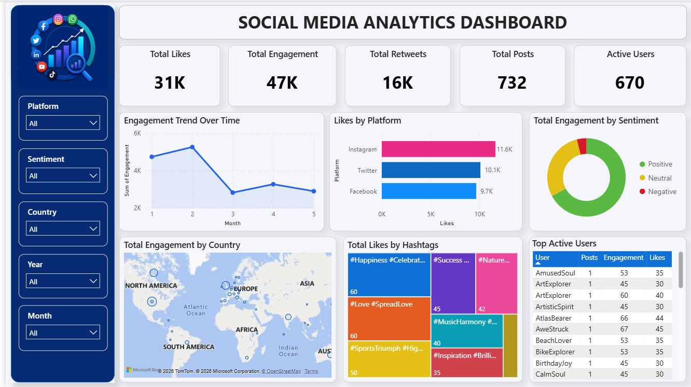

# 📱 Social Media Analytics Dashboard

End-to-End Data Analytics Project using Python, Pandas, Excel, and Power BI.

## 📌 Project Overview

The Social Media Analytics Dashboard is an end-to-end Data Analytics project developed using Python, Pandas, Excel, and Power BI.

The project focuses on analyzing social media performance, engagement, follower growth, posting patterns, sentiment, and campaign performance.

The goal is to convert raw social media data into meaningful insights that help understand audience engagement and content performance.

## 📊 Dashboard Preview

## 🎯 Project Objectives

- Analyze social media engagement
- Track follower growth
- Identify high-performing content
- Analyze posting time performance
- Understand sentiment trends
- Evaluate campaign performance
- Create an interactive Power BI dashboard

## 🛠️ Tech Stack

| **Category** | **Technologies** |
|---|---|
| Programming Language | Python |
| Data Processing | Pandas, NumPy |
| Data Source | CSV (.csv) |
| Data Analysis | Python, Pandas, MS Excel |
| Microsoft Excel | Data storage and preliminary analysis |
| Data Visualization | Power BI |
| IDE / Tools | VS Code, Jupyter Notebook, Power BI Desktop |
| Version Control | Git & GitHub |

## 📂 Dataset

The dataset contains social media information used to analyze engagement, followers, posting performance, sentiment, and campaign performance.

The dataset is provided in CSV format.
